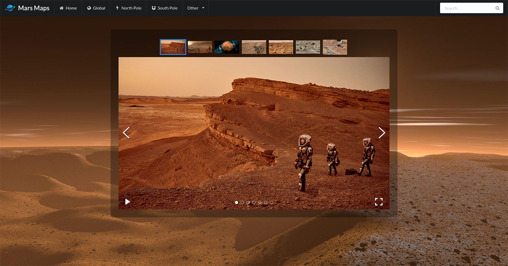

# Mars Maps

Frontend project created to checkout SVG Manipulation and SemanticUI framework. Users can view mars map places with interactive SVG plain. In addition, there is more info and gallery of mars in separate pages.

Live Site - https://mapofmars.surge.sh/gallery
